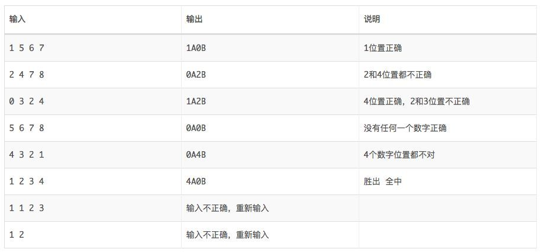

# guess-number

## 整体需求

实现猜数字的游戏。游戏有四个格子，每个格子有一个0到9的数字，任意两个格子的数字都不一样。你有6次猜测的机会，如果猜对则获胜，否则失败。每次猜测时需依序输入4个数字，程序会根据猜测的情况给出xAxB的反馈，A前面的数字代表位置和数字都对的个数，B前面的数字代表数字对但是位置不对的个数。

例如：答案是1 2 3 4， 那么对于不同的输入，有如下的输出：


答案在游戏开始时随机生成。输入只有6次机会，在每次猜测时，程序应给出当前猜测的结果，以及之前所有猜测的数字和结果以供玩家参考。输入界面为控制台（Console），以避免太多与问题无关的界面代码。输入时，用空格分隔数字。

## 任务分解
* 1、随机生成答案
* 2、判断每次猜测结果
* 3、返回猜测的数字和结果
* 4、判断游戏结果
* 5、输入不正确校验

## 任务细分(以及优先级)
* 2、判断每次猜测结果

思考：职责的承担者--- game

| 输入 | 输出 |
| --- | --- |
| 5 6 7 8 | 0A0B |
| 1 2 3 4 | 4A0B |
| 4 3 2 1 | 0A4B |
| 1 5 6 7 | 1A0B |
| 2 4 7 8 | 0A2B |
| 0 3 2 4 | 1A2B |

* 1、随机生成答案

    生成答案成功，成功的标准是符合规格
        1、数字不能重复
        2、长度为4位
        3、数字范围0-9
    
职责的承担者是？

答案不应该暴露出来，应该不能直接通过game.generateAnswer(),这样已经暴露出来了
所以，应该有一个对象单独去生成答案，game拥有这个对象，暂定AnswerGenerator

因为有了AnswerGenerator，而且Game需要这个对象，这个时候，就应该修改GameTest，把AnswerGenerator放到Game中


* 3、返回之前猜测的数字和结果
职责的承担者是 game

* 4、判断游戏结果
    
    
    6次内猜对，则获胜
    6次都猜错，则失败
    超过6次，不能再猜
    
职责的承担者是 game

* 5、输入不正确校验


        1、数字不能重复
        2、长度为4位
        3、数字范围0-9
    
职责的承担者应该是?
根据单一职责原则，如果game类去承担该职责，就相当于Game还要承担解析输入字符串的职责，违背了单一职责原则

答案本身是基本类型，而且需要对答案进行解析、处理，这些行为是针对答案的，即数据本身，所以，根据信息专家模式，应该由数据本身承担职责，但信息本身是基本类型，需要将它改为对象

完成当前测试后，需要对AnswerGeneratorTest、Game进行修改

因为输入不合法最终是体现在game.guess()方法的调用过程中的，所以，需要对game.guess()加一个测试来保证调用正确

```java
    @Test
    void should_throw_exception_when_input_unValid() {
       Assertions.assertThrows(IllegalArgumentException.class, () -> game.guess("1 2"), "输入参数不合法");
    }

```
在加入这个测试之后，发现game中的guess逻辑要调整,需要将compare结果方法移到Answer类当中，这个时候先注释当前测试

```java
    public String guess(String guessAnswer) {
        checkGuessTimes();
        String result = answer.compareAnswer(guessAnswer);
        saveLog(guessAnswer, result);
        updateGameResult(result);
        return result;
    }
```
加入测试后，发现对guessAnswer的校验属于答案本身的行为，需要针对猜测答案字符串，创建Answer对象

## 对外的表现为


## 有哪些对象
游戏 Game

## 参考链接 
[一个完整的TDD演练案例](http://zhangyi.xyz/handout-tdd-code-kata/)